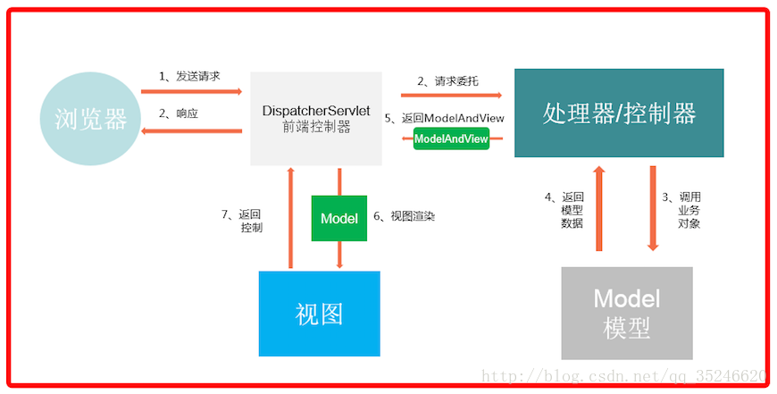

# Spring MVC

Spring Web MVC是一种基于Java的实现了Web MVC设计模式的请求驱动类型的轻量级Web框架，即使用了MVC架构模式的思想，将web层进行职责解耦，基于请求驱动指的就是使用请求-响应模型，框架的目的就是帮助我们简化开发

在Spring MVC框架中，从“Request（请求）”开始，依次进入“DispatcherServlet（核心分发器）” —> “HandlerMapping（处理器映射）” —> “Controller（控制器）” —> “ModelAndView（模型和视图）” —> “ViewResolver（视图解析器）” —> “View（视图）” —> “Response（响应）”结束，其中DispatcherServlet、HandlerMapping和ViewResolver 只需要在XML文件中配置即可，从而大大提高了开发的效率



# 扫描包

添加扫描包后注解才能生效

```xml
<context:component-scan base-package="com.ruiger.controller"/>
```

# 注解

```java
@Component
@Controller
@ResponseBody
@Resource
@Service

@TableName("app_version")
@TableId(value="id_User",type= IdType.UUID)
@TableField(value = "id_Organization")
@TableField(exist=false)

@JSONField(format="yyyy-MM-dd HH:mm")
```

